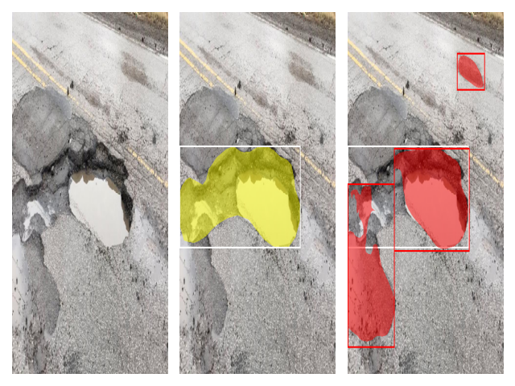
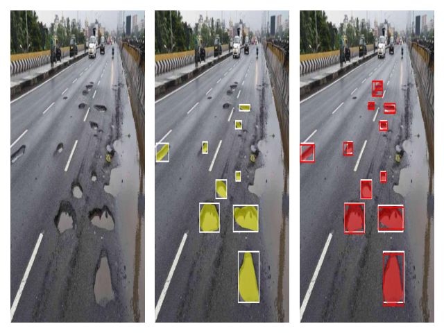
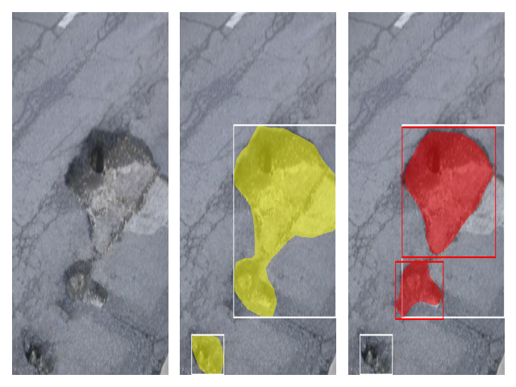

# PotholeSegmentation

## Introduction
Istance segmentation of images depicting road potholes using MASK-RCNN.

[TODO] The same model is subsequently applied to street videos, offline, frame by frame, with the aim of promptly detecting the presence of potholes.

## Screenshots

## License
This project is licensed under the [GNU General Public License v3.0](LICENSE).