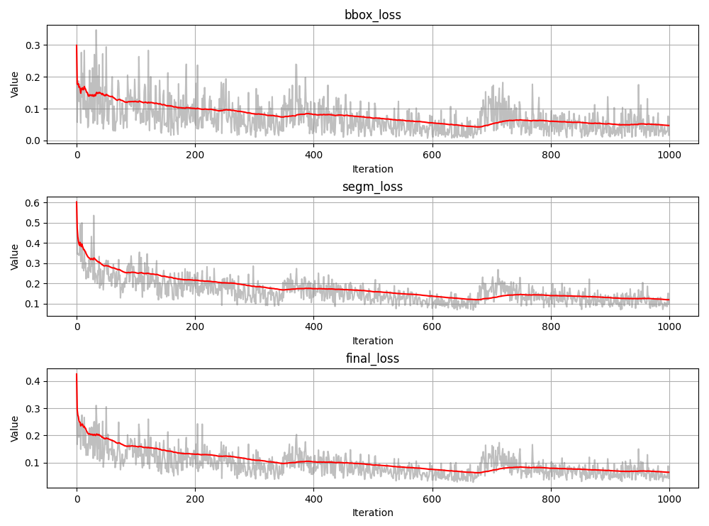
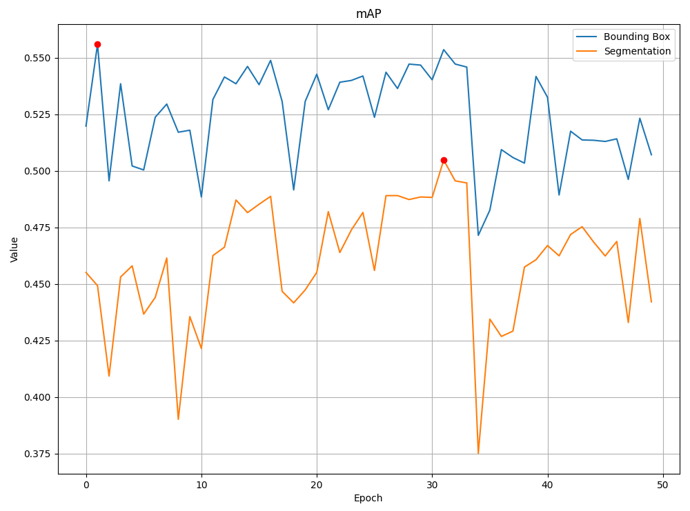
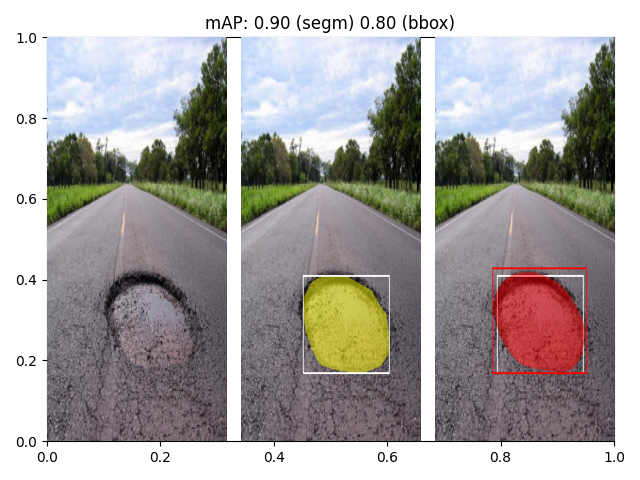
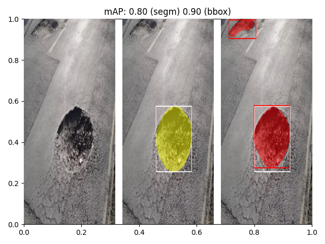
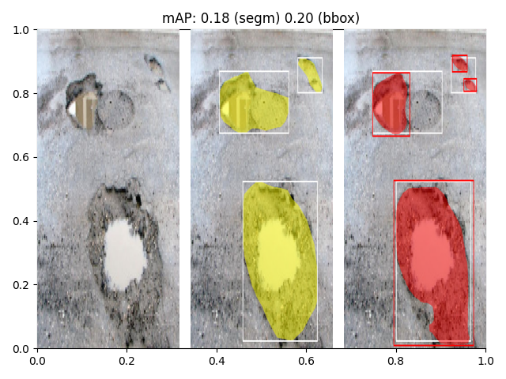

# PotholeSegmentation

## Introduction
Implementation of the Mask R-CNN archi- tecture for the task of road pothole istance segmentation. The model is able to achieve good performance on the task, also an analysis of the results obtained on the dataset used for the experiments is shown: results show that the main restriction is the lack of a large well labelled dataset and the ambiguity of the definition of pothole itself.

The model achieve an mAP of 50% on the test set for the segmentation task and an mAP of 55% for the bounding box regression task.

## Performance

### Training Loss

### Training Accuracy on Validation Set

## Demo Example
Every image is shown as a triplet: the outer left is the original image, the middle one is the ground truth and the right one is the prediction of the model.

   
### Example 1: Good Prediction (Easy)

   
### Example 2: Good Prediction with bad label

   
### Example 3: Good Prediction with bad label: performance suffers from the lack of a well defined label

   
## License
This project is licensed under the [GNU General Public License v3.0](LICENSE).